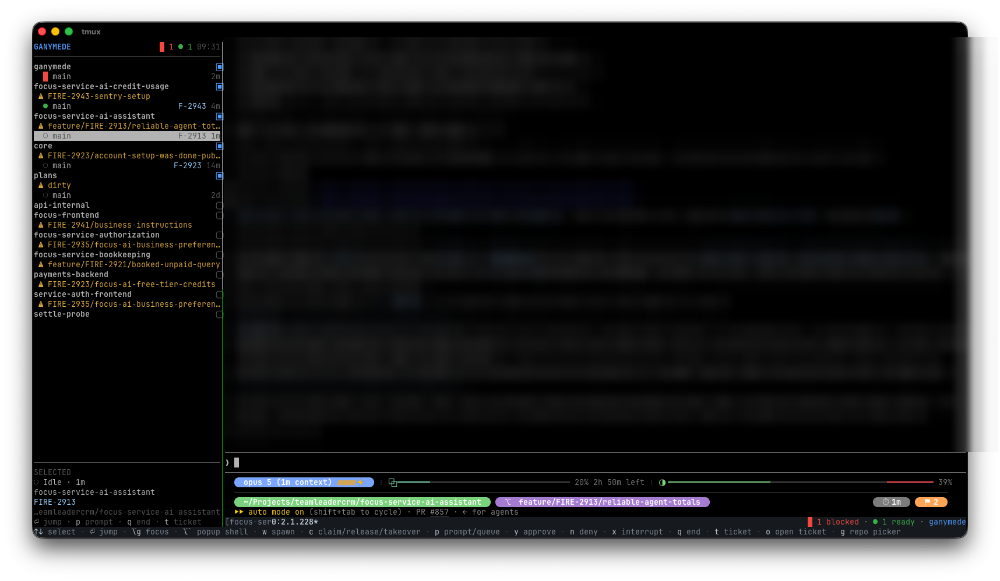

# Ganymede

> **Status:** actively evolving — claim/takeover, worktree spawn, and notifications all work day-to-day; rough edges are still being sanded down.

## Table of contents

- [What it is](#what-it-is)
- [How to use it](#how-to-use-it)
  - [See what needs you](#see-what-needs-you)
  - [Spawn a worktree session for a ticket](#spawn-a-worktree-session-for-a-ticket)
  - [Claim a root for PR review](#claim-a-root-for-pr-review)
  - [Get notified when you're away](#get-notified-when-youre-away)
  - [Keys](#keys)
- [How to install](#how-to-install)
  - [Prerequisites](#prerequisites)
  - [Install](#install)
  - [Run](#run)
- [Learn more](#learn-more)
- [License](#license)

## What it is



Ganymede is a terminal harness for day-to-day multi-repo Claude Code work on macOS: an always-visible dashboard that shows which repos have agent sessions open, which of those need you, and which main checkouts are free — so you can jump straight to whatever needs attention instead of hunting across terminal windows.

## How to use it

Once it's running (see [How to install](#how-to-install)), Ganymede docks a sidepanel to the left of your terminal. Everything below happens from there.

### See what needs you

The sidepanel lists your repos, each with its sessions nested underneath. Sessions needing you sort to the top — **Blocked** above **Ready**, longest-waiting first — so the row at the top of the list is always the most urgent thing waiting on you. Use `↑`/`↓` to move the selection; the box at the foot of the panel shows full detail for whatever's highlighted — the blocked reason, the last message, the ticket, the working directory.

Press `⏎` on a session row to jump the working client straight to it, clearing that session's Ready badge as you go. Press `⏎` on a repo's own header row to go to that repo instead, starting a session at its main root if nothing is running there yet. A **Blocked** or **Ready** session is acted on the same way — jumping in is how you answer its dialog or read its output.

Don't see the repo you want? Press `g` to open a fuzzy picker over every repo Ganymede can find under `~/Projects`. Typing narrows it — `gnm` reaches `ganymede` — and `⏎` takes you there and adds it to the sidepanel.

### Spawn a worktree session for a ticket

Press `w` on a repo to open a background session in its own git worktree, leaving the main root untouched. The dialog takes two optional fields: a JIRA ticket ID (the worktree gets named after it, e.g. `FIRE-2841-paging`) and a first prompt — fill that in and the session starts working immediately, fire-and-forget. Worktree sessions always start in Claude Code's auto permission mode, since the isolation of a worktree justifies it.

### Claim a root for PR review

Checking out a PR means using a repo's main root — but if an agent session already has it checked out, even an idle one, it's still holding context tied to that checkout. Press `c` on a repo's header row to see what that does for its current state:

- **Free** root: opens a Claim dialog (with an optional note, e.g. "reviewing FIRE-2841") — this reserves the root and warns worktree spawns away from it.
- **Claimed** root (by you): releases it immediately, no confirmation.
- **In-use** root, with its only occupant Idle: opens a **Takeover** confirmation — accepting it ends that session and claims the root behind it in one action. Refused if the occupant is Working or Blocked.

### Get notified when you're away

Whenever Ghostty isn't the frontmost app, Ganymede's notifier is the one place alerts come from. A **Blocked** session pings you immediately and stays sticky until you resolve it. A **Ready** session — done, but you haven't looked yet — stays a silent dashboard badge at first, and only escalates to a notification if it's still unseen about a minute later. Clicking a notification focuses Ghostty and jumps you straight to that session.

A banner you've dismissed is gone, so the count doesn't live there alone: for as long as the dashboard is up, the number of Blocked sessions also sits in your menu bar as `█ 2` and as a badge on Ganymede's own Dock icon — visible from whatever app you're actually in, and gone the moment nothing is blocked. Click either one to bring Ghostty forward. Both need `make launcher` to have been run; without it the harness simply has no icon of its own.

### Keys

| Key | On | Action |
|---|---|---|
| `⏎` | session row | Jump — switch the working client to the session (clears Ready) |
| `⏎` | repo row | Go to the repo — switch the working client to its session, started at the main root if nothing is running there |
| `w` | repo | Spawn a worktree session |
| `c` | repo header | Claim (Free) / release (Claimed) / Takeover (In-use, sole Idle occupant) |
| `g` | anywhere | Fuzzy repo picker over the full inventory |
| `t` | session row | Set or correct the JIRA ticket |
| `o` | session row | Open the ticket link in the browser |
| `` Ctrl+` `` | global, no prefix | Toggle the popup shell — a scratch shell in the current session's directory. Closing hides it, never kills it. `` Alt+` `` is bound to the same action, for an emulator that can't send `` Ctrl+` `` apart from `Ctrl+Space` |
| `↑` / `↓` | anywhere | Move the selection |
| `Alt+g` | anywhere | Move focus between the sidepanel and the working client |
| `Shift+⏎` | typing to Claude | Newline instead of sending — it sends what `Alt+⏎` sends |

The bottom row of the dock is this table, so the whole vocabulary is on screen while you're learning it. It lists every key, including the ones that do nothing on the row you happen to be standing on — the SELECTED box is the one that only ever offers what will actually fire. A window too narrow for the whole list drops keys off the right-hand end, worth-least first.

## How to install

### Prerequisites

| Requirement | Why | Get it |
|---|---|---|
| macOS | Ganymede is built around Ghostty and macOS-only notification APIs — there's no Linux support | — |
| [Claude Code](https://code.claude.com) | Ganymede is a harness *for* Claude Code sessions | https://code.claude.com |
| [Ghostty](https://ghostty.org) | The terminal emulator Ganymede docks its dashboard into | https://ghostty.org |
| tmux (3.3+) | The multiplexer Ganymede's dashboard and sessions run on | `brew install tmux` |
| Go toolchain | To build the `ganymede` binary | https://go.dev/dl/ |
| Xcode Command Line Tools | `make launcher` compiles the Dock tile app with `swiftc` | `xcode-select --install` |
| [terminal-notifier](https://github.com/julienXX/terminal-notifier) | Ganymede's own OS notification channel — without it, Blocked/Ready alerts don't fire beyond the dashboard | `brew install terminal-notifier` |

### Install

Clone this repo, then build the binary:

```sh
go build -o bin/ganymede ./cmd/ganymede
# or: make build
```

### Run

| Command | Does |
|---|---|
| `ganymede up [directory]` | Open the harness for the repo at *directory* (default: the current one) — installs config and hooks, brings up sessions, opens the Ghostty window |
| `ganymede dashboard` | Run the dashboard standalone in the current terminal |
| `ganymede install` | Install the tmux/Ghostty config and the Claude Code hooks only, without opening a window |

`ganymede up` is what you want day-to-day:

```sh
./bin/ganymede up
# or: make up
```

It's safe to re-run — it reuses whatever's already up and installs over itself rather than beside itself. Inside the window, `Alt+g` moves between the sidepanel and the working client; the dock itself runs with no prefix key, so `C-b` and everything else belongs to the session you're working in.

Rebuilding the binary is not enough to pick up a change: `up` only ever reuses an already-running Dashboard rather than restarting it. `make refresh` (or `scripts/refresh.sh`) rebuilds and restarts the Dashboard's own tmux pane in place, leaving the dock, the working client and every repo Session untouched.

`make launcher` installs a `Ganymede.app` into `~/Applications`, so you can bring the harness up from Spotlight instead of a terminal. Run it once; re-run it if this checkout ever moves, since the app bakes in its absolute path.

## Learn more

- [docs/ARCHITECTURE.md](docs/ARCHITECTURE.md) — internals: layer choices, data flow, the full state model, the guarded action protocol, and the design decisions behind them
- [CONTEXT.md](CONTEXT.md) — the normative vocabulary this dashboard uses

## License

MIT — see [LICENSE](LICENSE). The Dock icon (`macos/launcher/Ganymede.icns`), sourced from [macosicons.com](https://macosicons.com/), is excluded — see [NOTICE](NOTICE).
