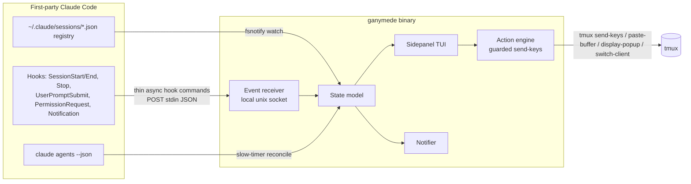
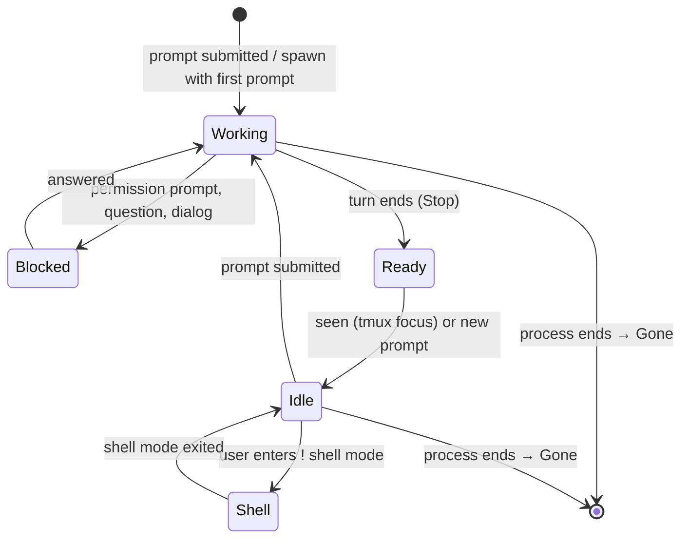

# Architecture

This is the internals reference for Ganymede's build: layer choices, data flow, the state model's full derivation rules, the guarded action protocol, and the decisions behind them.

If you just want to use Ganymede, see [README.md](../README.md). For the normative vocabulary these sections use (Dashboard, Session, Working set, Main root, Claimed, Takeover, ...), see [CONTEXT.md](../CONTEXT.md).

## Out of scope, permanently

Remote or mobile access, non-Claude agents as first-class citizens, PR/CI status display, and Warp-style shell niceties (blocks, AI suggestions, command palettes). These are design boundaries, not gaps to fill later — see [Deferred and declined](#deferred-and-declined) for the things that might still happen.

## Layers

| Layer | Choice | Role |
|---|---|---|
| Emulator | **Ghostty** | Purely the window tmux lives in — no Ghostty tabs or splits are used. Native macOS, GPU rendering, kitty keyboard protocol (transmits `` Ctrl+` `` distinctly). |
| Multiplexer | **tmux** | Substrate for sessions, windows, popups, the status bar, and the send-keys control path. |
| Harness | **One Go binary (`ganymede`), bubbletea TUI** | Dashboard, event receiver, notifier, tmux orchestration. Single static binary; no third-party session manager. |
| Heavy lifting | **First-party Claude Code primitives** | `claude --worktree` (spawn), `~/.claude/sessions/<pid>.json` registry (state), hooks (events), `claude agents --json` (reconciler). |

### Topology

- **One tmux session per repo**, named after the repo. Window 1 is the main root; each worktree session gets its own window, named after the worktree (which carries the ticket ID). Two repos wanting the same name — an `api` under more than one organisation — are told apart by qualifying the second with the directory it is filed under (`acme-api`), so the picker can never quietly take you to the other one.
- **One persistent `ganymede` tmux session** hosting the dashboard TUI.
- **The dashboard is a docked sidepanel.** One Ghostty window holds two tmux clients side by side: a narrow (~40-column) left client permanently attached to the `ganymede` session, and the **working client** on the right showing the repo session in focus. The dashboard steers the working client with `switch-client -c`.
- The working client's tmux status line carries an ambient **attention strip** — `█ N blocked · ● M ready` — deliberate redundancy with the dashboard, sitting under your eye line inside the session you're focused on.

## Data flow

- **Registry watch** is authoritative for state: `~/.claude/sessions/` holds one JSON file per session with `pid, sessionId, cwd, name, status, waitingFor, statusUpdatedAt, kind`. Pids are liveness-checked; a vanished file or dead pid means the session is **Gone**.
- **Hooks** provide sub-second edges and rich payloads. Installed user-level in `~/.claude/settings.json` so every repo is covered. Hook commands are thin — forward stdin JSON to the receiver socket, async where no response is needed, never blocking a session.
- **The reconciler** runs `claude agents --json` on a slow timer (30s) as the documented, schema-stable cross-check. The registry files are undocumented, so their shape must be re-verified on Claude Code upgrades (verified against **2.1.226** as of this writing, unchanged from the 2.1.220 record in the spec's §11). Sessions the registry watch missed are added; where the two describe the same session differently, the reconciler wins. Three things it does not do: overrule a registry record the registry has moved on *since* the cross-check was asked (that is the registry running ahead, not disagreeing); overrule anything at all when it cannot read the session's status, since a defaulted state must never outrank a read one; or remove a row, because it is always the older picture of the two. A row it added is dropped by the next cross-check once the session ends, so the reconciler is accurate to one tick — and a session only it can see may show as Blocked with no reason, since the reason lives in the registry file the watch could not read.
- **Harness state** (its own sidecar, e.g. `~/.config/ganymede/state.json`) holds root claims and notes, manual ticket overrides, per-repo last-activity timestamps, popup-shell ownership, and Ready/seen tracking.

### CLI entry points other tools invoke

These are never typed by hand — see the README's [Run](../README.md#run) section for the commands you do run.

| Command | Invoked by | Role |
|---|---|---|
| `ganymede hook` | Claude Code hooks | Reports a hook payload on stdin to the event receiver |
| `ganymede seen <pid>` | tmux's `pane-focus-in` hook | Marks the sessions inside a process as seen, clearing their Ready badge |
| `ganymede frozen <pane-pid> <0\|1>` | tmux's `pane-mode-changed` hook | Reports that a pane has started or stopped holding a mode over its live view, which is what marks the sessions inside it Frozen |
| `ganymede notify-click <pid>` | A clicked OS notification | Focuses Ghostty and jumps to the session the notification was about |

## State model

### Session states

| State | Meaning | Primary signal |
|---|---|---|
| **Working** | Turn (or subagents) running; nothing asked of you | registry `status: busy` |
| **Blocked** | Cannot continue without your decision; **always shown with its reason** | registry `status: waiting` + `waitingFor` |
| **Ready** | Turn finished, output unseen — an unread badge | registry `status: idle` *and* not yet seen |
| **Idle** | At the prompt, seen, nothing pending | registry `status: idle` + seen |
| **Shell** | Occupied by you (`!` shell mode) | registry `status: shell` |
| **Gone** | Process ended; the row disappears | registry file gone / pid dead |

**Attention = Blocked ∪ Ready.** Blocked outranks Ready; within a tier, longest-waiting first. Repos sort by their most urgent session. Seeing a session — tmux focus landing on its pane, or a new prompt — clears Ready to Idle; the harness tracks "seen" itself, the registry does not.

**Frozen is not a session state.** A pane holding a tmux mode over its live view shows a held picture of the session while the session itself carries on, so it coexists with every state above rather than replacing one — see CONTEXT.md's *Pane view*. It is a mark on the row, not a row's state: sourced from the `pane-mode-changed` hook with a half-minute `#{pane_in_mode}` sweep as the cross-check, held by the dashboard alone rather than by the state model, and changing nothing about Attention, ordering, or notifications. A session Blocked behind a Frozen pane is still Blocked and still pings.

### Main-root states

| State | Meaning | Rules |
|---|---|---|
| **Free** | No live session cwd'd in the main root, no claim | Safe to check out a PR. |
| **In use by agent** | *Any* live session has the root as cwd — **even an Idle one**, since an idle agent still holds context bound to that checkout | Strict; softened only by Takeover. |
| **Claimed** | Explicitly reserved by you, optionally with a note (typically PR review) | Warns agent spawns away; released explicitly. The dashboard nudges release once the root is back on the default branch with a clean tree. |

**Takeover** claims a root whose only occupant is an Idle session, ending that session in the same action. It is refused when the occupant is Working or Blocked. Git caution markers (off-default branch, dirty tree) show on the root row independently of these states.

## Dashboard internals

- **Repo tree** (~40 columns, always visible, left): repo header rows with root-state chip and git caution markers, indented session rows with state glyph, the marks for a Frozen pane (`❄`) and a busy popup (`⏵`), session/worktree name, abbreviated ticket ID, and wait age. Attention tier sorts first, then recency.
- **SELECTED detail box** at the foot: full detail for the highlighted row — blocked reason or last-message snippet, full ticket ID, cwd — plus the inline input for prompt and confirm actions.
- **Main panel** (right): the live session in focus. `⏎` on a row jumps there.

### Working set

The dashboard shows repos with a live session, a Claimed root, or harness activity in the last 7 days (window configurable) — expected size 5–10 rows. Discovery scans configured roots, default `~/Projects` at depth ≤ 3, excluding worktree checkouts; sessions living outside the scan roots still appear, since the registry's `cwd` is ground truth. Everything else sits behind the fuzzy picker (`g`) over the full inventory — jumping or spawning into a repo puts it on the dashboard. A repo drops off after the recency window with no sessions and no claim, and is never evicted while live or Claimed.

A checkout is a repo when its `.git` is a directory. A worktree checkout, a submodule and a `--separate-git-dir` checkout all keep a `.git` *file* naming a git directory elsewhere, so none of the three is offered as a repo of its own — which is also what stops the scan descending into the trees vendored inside a checkout. Per-repo activity is stamped whenever a session is running in a repo and whenever you open one yourself, and lives in its own section of the harness state file so the working set survives a restart.

## Acting on sessions

Sessions are interactive in panes. Inline actions cover exactly the safe-to-script subset; everything richer is one `⏎` away, because "focus the pane" is always the honest fallback.

The `PermissionRequest` hook is a **reporter only** — it forwards `tool_name`, `tool_input`, and `session_id` to the receiver and exits immediately, so the pane's dialog never lags and the sidepanel still gets instant blocked context.

**Guarded send-keys** is the single action transport, in strict order:

1. Gate on the registry — state must match the action's precondition and `statusUpdatedAt` must be fresh.
2. Ask `#{pane_in_mode}` — a **Frozen** pane hands the keystroke to the mode's own key table, and `capture-pane` cannot reveal this, since it returns the live screen the mode is holding a view over. Asked before the capture: it is the cheaper question, and it decides whether the other is worth asking.
3. `tmux capture-pane` and verify the expected content (the permission-dialog tool line, an empty input box for prompt-send).
4. Send only `Y` / `N` / `Esc` / `Enter` / bracketed-paste text (`set-buffer` + `paste-buffer -p`).
5. Re-verify with capture-pane.

Any mismatch at any step means **do nothing and focus the pane instead**. Channels is the designated future replacement once it leaves research preview with a non-dangerous custom-channel opt-in.

## Worktree sessions

`claude --worktree <name>` is adopted as-is — worktree and branch under `.claude/worktrees/`, `.worktreeinclude` env copying, per-repo `worktree.baseRef`, reopen-by-name, and built-in exit-time cleanup. No custom worktree management.

`w` on a repo opens a dialog with two optional fields: a **JIRA ticket ID**, from which the worktree name derives plus an editable short suffix (e.g. `FIRE-2841-paging`), and a **first prompt**, which when filled makes the spawn fire-and-forget — the session starts working immediately. Launch is a new tmux window in the repo's tmux session, with the window name and the Claude session name (`claude -n`) both set to the worktree name, so the ticket rides in the registry, terminal title, and dashboard for free.

Spawned worktree sessions **always start in auto permission mode** — the worktree's isolation justifies it, and whatever auto still gates simply surfaces as Blocked.

Ending a session goes through the dashboard's `q` action → graceful exit → Claude Code's own cleanup prompt. The `worktree-prune` skill covers stragglers.

## Popup shell

- **Identity:** per-session — it belongs to the session or window in focus and opens in that pane's current directory (or the dashboard's selected repo when focus is on the tree).
- **Primitive:** `tmux display-popup`, centered, ≈75% × 75%, plain shell.
- **Persistence:** closing **hides, never kills**. Scrollback, history, and running commands survive in a hidden tmux session per owner, auto-killed when the owning session goes Gone.
- **Gesture:** one no-prefix toggle key, default `` Ctrl+` ``, which both opens and closes. An Alt-chord is the fallback for emulators that can't transmit it distinctly.
- **Model:** it never affects session or root states — it's you, not an agent. A hidden popup with a running command shows a busy marker on its owner's row and is mentioned in claim and takeover confirmations ("popup running: composer install").

## Notifications

"Beyond the dashboard" means whenever Ghostty isn't frontmost.

- **Single owner.** The harness notifier is the only OS channel. Install sets `preferredNotifChannel: notifications_disabled` and absorbs the existing osascript hook wiring, so there are no double banners.
- **Policy.** Blocked pings immediately. Ready is silent — dashboard badge only — until the first-party 60s `idle_prompt` signal arrives; if the session is still unseen at that moment, one notification fires.
- **Focus-aware.** No banners while Ghostty is frontmost.
- **Anatomy.** Title is repo + ticket (`service-ai-assistant · FIRE-1234`); body is the reason — `waitingFor` for Blocked, a `last_assistant_message` snippet for Ready. Clicking focuses Ghostty and jumps the dashboard to that session. Sound on Blocked only.
- **Missed pings.** Blocked notifications use macOS **Alerts style** — sticky until dismissed or resolved, with no re-nagging. Setting the notifier app to Alerts is a one-time System Settings step.

## JIRA tickets

Precedence is manual override → branch name → worktree directory name → no ticket. Derivation takes the first match of `[A-Z][A-Z0-9]*-\d+` in the session's git branch name, else in the worktree dir name; dashboard-spawned sessions need nothing extra. A manual override (`t`) is stored keyed by **repo + branch/worktree path** — not session id, so it survives restarts — and evicted when that branch or worktree disappears. Sessions with no ticket render a dim "no ticket", never a placeholder key. Links go to `https://teamleader.atlassian.net/browse/<KEY>` and open with `o`. Ticket ID and link only — **no JIRA API dependency, ever**.

## What the harness writes

A config fragment at `~/.config/ganymede/tmux.conf` — `allow-passthrough on`, `focus-events on`, the status-line strip segment, and the root-table popup binding — sourced from a marked block in your `tmux.conf`; a Ghostty config fragment at `~/.config/ganymede/ghostty.conf` — fresh defaults (JetBrains Mono, a built-in dark theme) and the Cmd+F keybind — loaded from a marked block in `~/.config/ghostty/config.ghostty`; the dock's own config at `~/.config/ganymede/dock.conf`; its event socket at `~/.config/ganymede/events.sock`, owned by one dashboard at a time — a second `ganymede dashboard` refuses to start rather than take it; its own state at `~/.config/ganymede/state.json`, currently the tickets you set by hand and the per-repo activity the working set is built from, written a section at a time so that nothing else in it is disturbed; and its own hook entries in `~/.claude/settings.json`, which are replaced rather than repeated on every install and leave the rest of that file, permissions included, untouched.

Three things in that fragment are the harness's to own: tmux's global `pane-focus-in` hook, which is how seeing a session clears its Ready badge; its global `pane-mode-changed` hook, which is how a pane holding a mode over its live view earns the Frozen mark and loses it again; and the `@ganymede-seen` option both of them read. A `pane-focus-in` or `pane-mode-changed` hook of your own in `tmux.conf` would be replaced by them.

## Build order

Non-binding; the plan owns the real slicing. This ordering just respects the dependency grain.

1. **Read-only dashboard** — registry watch, hook install, reconciler → live states, ordering, status strip, jump (`⏎`), picker (`g`).
2. **Roots & claims** — root-state derivation, Claim/release/Takeover, git caution markers.
3. **Spawn & popup** — the `w` flow over `claude --worktree`, popup shell.
4. **Inline actions** — the guarded send-keys engine, then `y`/`n`, `p`, `x`, `q`.
5. **Alerting** — notifier, focus check, sticky Blocked alerts, Ready escalation, settings absorption.
6. **Install & migration** — Ghostty and tmux config fragments, hook/settings installer, `Cmd+F` keybind.

## Deferred and declined

| Item | Status |
|---|---|
| Worktree cleanup lifecycle (merge-back, auto-cleanup after PR merge, parking) | **Deferred** until real usage sharpens it. First-party exit cleanup and `worktree-prune` cover the interim. |
| Background agents attached into panes (`claude --bg` + `claude attach`) | **Declined** for now — stop/respawn/logs and daemon supervision aren't worth the attach choreography, single-client semantics, and an unverified `--worktree` combination. Revisit if resilience becomes a felt need. |
| Channels as the action transport | **Deferred** pending preview exit. |
| Blocking / armed-verdict `PermissionRequest` pattern | **Declined** — the hook is report-only; blocking would delay every dialog. |

## Migration from Warp

Warp runs stock, so there are no custom keybindings, theme, or font to port. The one surviving muscle memory is `Cmd+F` find-in-output, which becomes a Ghostty keybind translating to tmux copy-mode search (tmux owns the scrollback). Not carried over: Cmd tab/split/close/digit keys (the harness owns layout), Warp history search and autosuggestions (out of scope), and block selection — the vertical-tabs habit is succeeded by the dashboard itself. Cutover is parallel with no deadline: Ghostty and tmux run alongside Warp from install, and Warp is removed whenever it has clearly gone unused.

## Design documents

The specification and its supporting material live in the planning repo at `~/Projects/plans/Ganymede-harness/`:

| Document | Role |
|---|---|
| `SPEC.md` | Single source of truth for the build — restates every decision in full |
| `CONTEXT.md` | Normative vocabulary |
| `MAP.md` | Decision map; all 13 decision tickets closed |
| `issues/` | Per-decision history and rationale — not requirements |
| `prototype-dashboard-mock.html` | Validated UI reference (variant D) |
| `research/` | Source research behind the stack choices |
